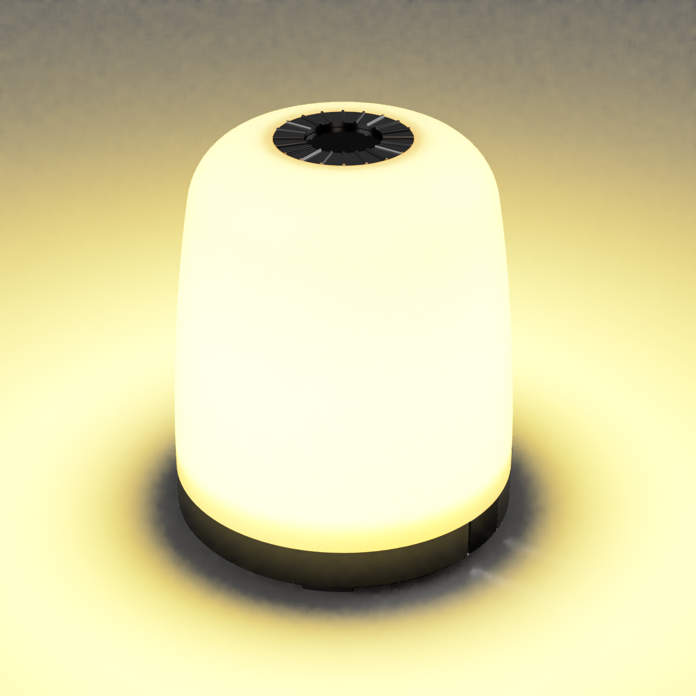
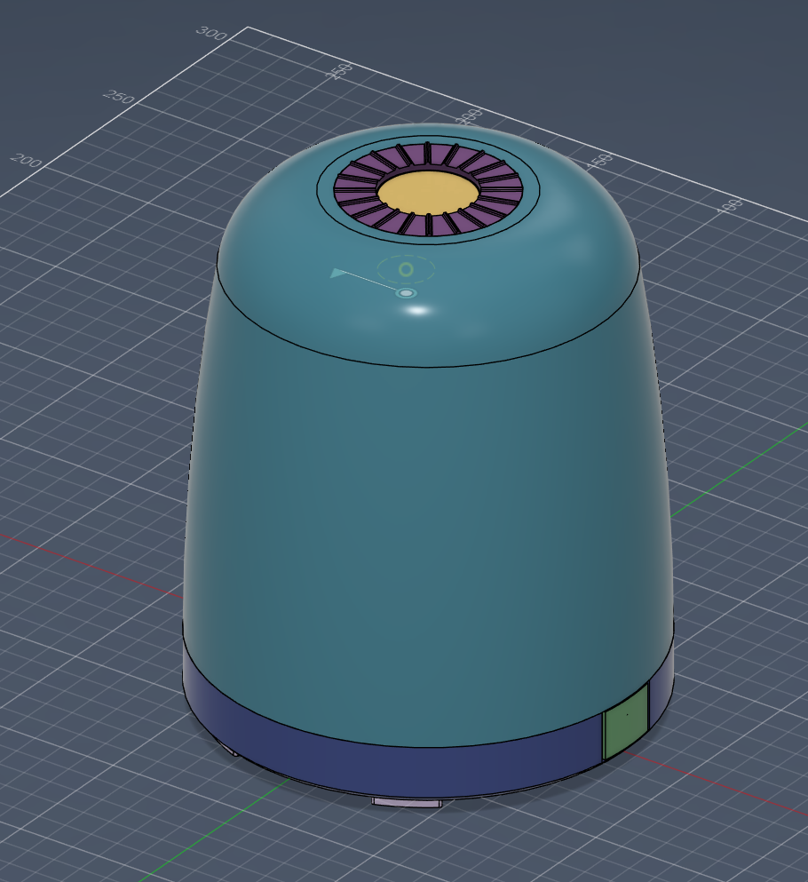
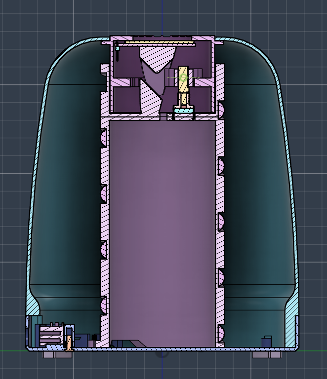
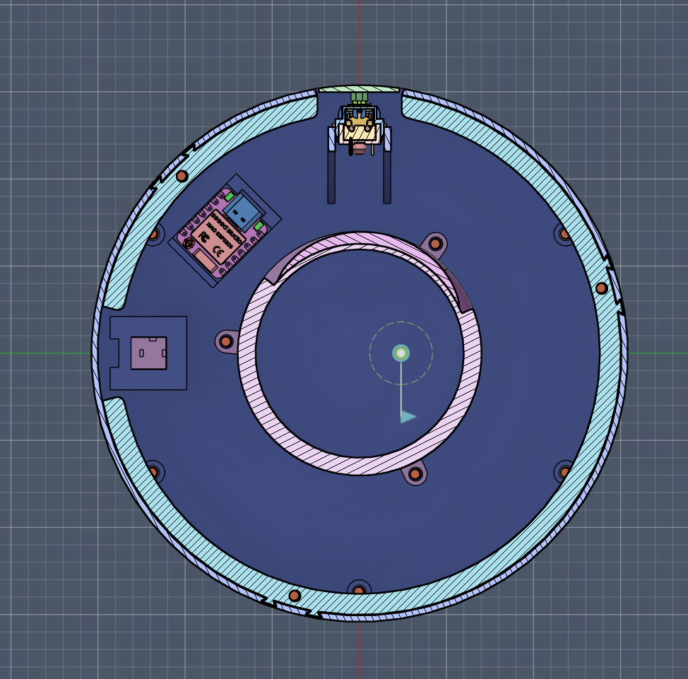
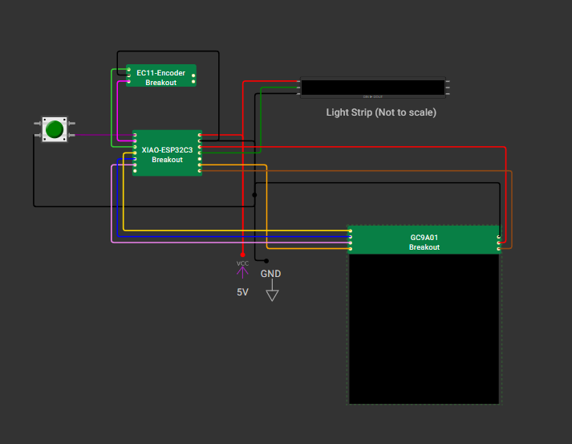

# HA-Sunrise-Lamp-Alarm

## Overview

### Description
This is an alarm clock that integrates with Home Assistant, and helps wake you up by gradually increasing the brightness of the light.

### Why I made this project
I made this project because I had a fairly old light alarm that I  liked and helped me wake up every day. However, it has no smart features and there is no way to configure a schedule (so that it doesn't run on the weekends) or create some cool light effects. This caused me to design my own that would integrate with Home Assistant, allowing me to easily control what days and time it runs, and even create some special effects.

### Pictures

## Electrical

This project uses an SK6812 LED, generic keyboard button, and an XIAO ESP32 C3 microcontroller.

https://wokwi.com/projects/458952556724127745

**VCC**
- Connect 5v from the barrel jack to the 5v port of the ESP and the light strip
- Connect 3.3V from the ESP to the GC9A01 display (VCC and BLK pins)

**GND**
- Connect GND from the barrel jack to the GND port of the ESP, the light strip, one of the button pins, and the encoder ground

**Light Strip**
- Connect the pin D10 (GPIO 10) to the light strip

**Button**
- Connect the pin D0 (GPIO 2) to the button

**Encoder**
- Connect pin D2 (GPIO 4) to OUT A
- Connect pin D1 (GPIO 3) to OUT B

**Display (GC9A01)**
- Connect D8 (GPIO 8) to SCL
- Connect D7 (GPIO 20) to SDA
- Connect D5 (GPIO 7) to RST
- Connect D4 (GPIO 6) to DC
- Connect D3 (GPIO 5) to CS

## BOM

See the material list here: [BOM](./Sunrise%20Lamp%20Alarm%20BOM.csv)